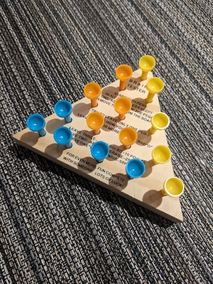

This is my code to solve the peg game.

There are different versions of this game. You can learn more about Peg Solitaire on [Wikipedia](https://en.wikipedia.org/wiki/Peg_solitaire).

Here I am solving the triangle version (it's the one you can find at Cracker Barrel.)



The txt files are output of the program for different starting position.
The name of the file indicates with peg has been removed.

```
==> b21.txt <==
    1
   1 1
  1 1 1
 0 1 1 1
1 1 1 1 1

==> b31.txt <==
    1
   1 1
  0 1 1
 1 1 1 1
1 1 1 1 1

==> corner.txt <==
    1
   1 1
  1 1 1
 1 1 1 1
0 1 1 1 1

==> standard.txt <==
    1
   1 1
  1 0 1
 1 1 1 1
1 1 1 1 1
```

I named the positions as tuples like this (here displayed the standard position with the middle peg missing):

```
pos = ({                 (5,1):1,
                    (4,1):1, (4,2):1,
                (3,1):1, (3,2):0, (3,3):1,
            (2,1):1, (2,2):1, (2,3):1, (2,4):1,
        (1,1):1, (1,2):1, (1,3):1, (1,4):1, (1,5):1}, [])
```

1 means there's a peg in the hole. 0 means there's no peg.

# Script inputs
The script expects 2 inputs:
- the starting position (standard, b21, b31, corner). Other values are ignored. A simple configuration is loaded. I used this to test.
- a number: the number of iteration to run. 13 is needed to solve the puzzle. This number is useful to test the code.

# Script output
We get the number of dead ends after each iteration.

For example for the standard starting position:
```
1: 0
2: 0
3: 0
4: 0
5: 0
6: 0
7: 0
8: 0
9: 1980
10: 39502
11: 62736
12: 20686
```

Which means that you can end up in a dead end after the 9th move.

# Solutions
All the solutions are listed.
The standard starting position has 1550 different solutions (I didn't consider symetry).

Here is one:

```
 774 ######### 1 / 12->32 14->12 24->22 21->23 42->24 41->21 11->31 31->33 24->42 51->33 33->13 12->14 15->13
    0
   0 0
  0 0 0
 0 0 0 0
0 0 1 0 0
```

The moves are listed: 12->32 means we take the peg in position (1,2) to the position (3,2)

So from 
```
    1
   1 1
  1 0 1
 1 1 1 1
1 1 1 1 1
```
to 
```
    1
   1 1
  1 1 1
 1 0 1 1
1 0 1 1 1
```
# Comparison of starting positions

The standard position is the most difficult one!

| File Name     | Number of Solutions |
|---------------|--------------------|
| standard.txt  | 1550               |
| b21.txt       | 14880              |
| corner.txt    | 29760              |
| b31.txt       | 85258              |

See the number of different solutions, it is much smaller than the b31! So use that configuration to increase your chances of winning:

```
    1
   1 1
  0 1 1
 1 1 1 1
1 1 1 1 1
```

